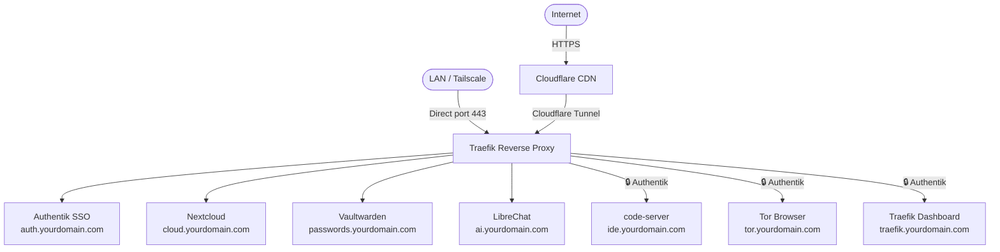

# homelab

Production-ready self-hosted stack: Traefik, Authentik, Nextcloud, Vaultwarden, LibreChat, and friends — zero open ports, full SSO, automatic TLS. Full disclosure: Claude assembled this while I supervised from a yogurt cup. Hire me, I delegate well.

---

## Stack

| Service | Purpose | Role | Auth |
|---------|---------|------|------|
| [Traefik](docs/services/traefik.md) | Reverse proxy + TLS | **Core** | — |
| [Cloudflared](docs/services/traefik.md#cloudflare-tunnel) | Cloudflare Tunnel (no open ports) | **Core*** | — |
| [Authentik](docs/services/authentik.md) | SSO / Identity Provider | **Core** | — |
| [CoreDNS](docs/tailscale-dns.md) | Split DNS for LAN bypass | Optional | — |
| [Nextcloud](docs/services/nextcloud.md) | Files, contacts, calendar | Optional | Own login |
| [Vaultwarden](docs/services/vaultwarden.md) | Bitwarden-compatible password manager | Optional | Own login |
| [LibreChat](docs/services/librechat.md) | AI chat (OpenAI-compatible + local Ollama) | Optional | Own login |
| [code-server](docs/services/code-server.md) | VS Code in the browser | Optional | Authentik |
| [Tor Browser](docs/services/tor.md) | Remote Tor access | Optional | Authentik |
| [Watchtower](docs/services/watchtower.md) | Automatic container updates | Optional | — |

*Cloudflared is required unless you forward port 443 directly on your router.

---

## How traffic flows



Services marked 🔒 require an Authentik session. Everything else handles its own authentication.

---

## Prerequisites

→ Full details: [docs/prerequisites.md](docs/prerequisites.md)

Short version:
- Docker + Docker Compose installed
- A domain managed by Cloudflare (free plan is fine)
- A Cloudflare API token with `Zone:DNS:Edit` permission
- A Cloudflare Tunnel created in the Zero Trust dashboard
- SMTP credentials for email notifications (Zoho, Gmail, etc.)

---

## Quick start

```bash
# 1. Clone
git clone https://github.com/yourusername/homelab.git /opt/homelab
cd /opt/homelab

# 2. Generate secrets
bash scripts/generate-secrets.sh

# 3. Fill in the secrets that require manual values
#    (Cloudflare tokens, SMTP password, IDE password — see output of step 2)

# 4. Copy and fill env examples
cp services/authentik/config/authentik.env.example services/authentik/config/authentik.env
cp services/librechat/config/librechat.env.example services/librechat/config/librechat.env
# Edit each file and replace all placeholder values

# 5. Replace yourdomain.com and /opt/homelab throughout
grep -r "yourdomain.com" services/ scripts/   # shows what needs changing
grep -r "/opt/homelab" services/ scripts/     # shows path references

# 6. Start everything
bash scripts/start.sh
```

---

## Repository structure

```
homelab/
├── docs/
│   ├── prerequisites.md        # Domain, Cloudflare, Docker setup
│   ├── architecture.md         # Network topology and design decisions
│   ├── tailscale-dns.md        # Optional: split DNS for LAN access
│   └── services/               # Per-service documentation
│       ├── traefik.md
│       ├── authentik.md        # Includes __FILE bug workaround
│       ├── nextcloud.md
│       ├── vaultwarden.md
│       ├── librechat.md
│       ├── code-server.md
│       ├── watchtower.md
│       └── tor.md
├── services/
│   ├── traefik/                # compose.yml + dynamic.yml
│   ├── authentik/              # compose.yml + authentik.env.example
│   ├── nextcloud/
│   ├── vaultwarden/            # compose.yml + vaultwarden.env.example
│   ├── librechat/              # compose.yml + librechat.yaml + librechat.env.example
│   ├── code-server/
│   ├── watchtower/
│   ├── tor/
│   └── dns/                    # CoreDNS compose + zone file
└── scripts/
    ├── start.sh                # Start all services in order
    ├── stop.sh                 # Stop all services in reverse order
    ├── generate-secrets.sh     # Generate all secrets
    ├── backup.sh               # Nightly DB dumps + rclone sync to encrypted cloud
    ├── restore.sh              # Pull from cloud and restart services
    └── com.homelab.backup.plist  # macOS launchd schedule (runs backup.sh at 02:00)
```

---

## Choosing what to run

**Must have (core stack):** `traefik` (includes cloudflared)

**Add Authentik if** you want SSO — required to protect code-server, Traefik dashboard, and Tor.

**Everything else is independent.** You can run Nextcloud and Vaultwarden without LibreChat, skip Tor, etc. Just remove the relevant `start`/`stop` lines from the scripts.

→ See [docs/architecture.md](docs/architecture.md) for dependency details.

---

## Notes

- Tested on a **Mac Mini M4 (Apple Silicon / ARM)** running Docker Desktop. Works on Linux with Docker Engine. The Tor Browser container requires `platform: linux/amd64` and runs via Rosetta on ARM — everything else is native.
- Paths in compose files use `/opt/homelab` as the base data directory. Change this to wherever your data lives.
- Subdomains use `yourdomain.com` as a placeholder — replace throughout.
- All secrets are stored as individual files in `secrets/` (Docker secrets pattern). The directory is gitignored.
- Watchtower runs weekly (Sunday 03:00) and sends email reports. Services with schema migrations (`nextcloud`, `vaultwarden-db`) are set to monitor-only.

---

## Backup

`scripts/backup.sh` runs nightly and backs up everything automatically — see [docs/backup.md](docs/backup.md) for full setup.

- Dumps all databases live from running containers (MariaDB, PostgreSQL, MongoDB)
- Syncs everything to an encrypted Google Drive remote via `rclone crypt` (Google cannot read your files)
- Retains DB dumps locally for 7 days, remotely for 30
- Runs nightly at 02:00 via launchd (`com.homelab.backup.plist`) or cron

---

## License

MIT — see [LICENSE](LICENSE).
